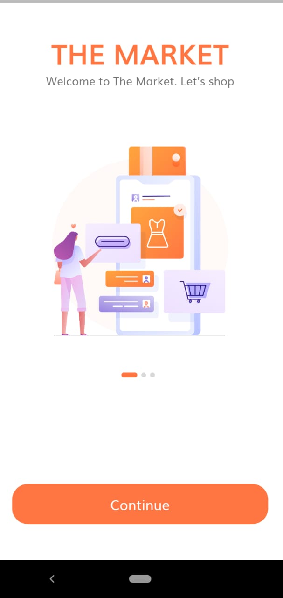
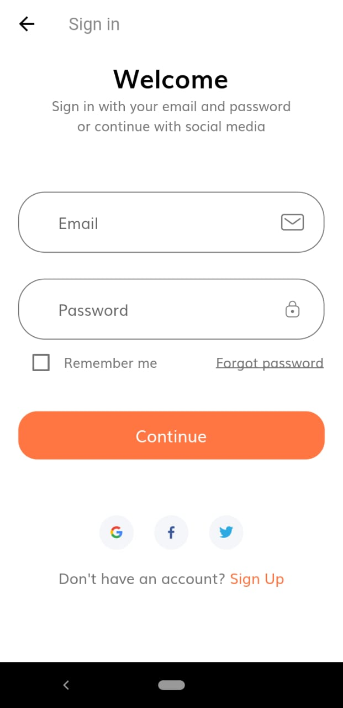
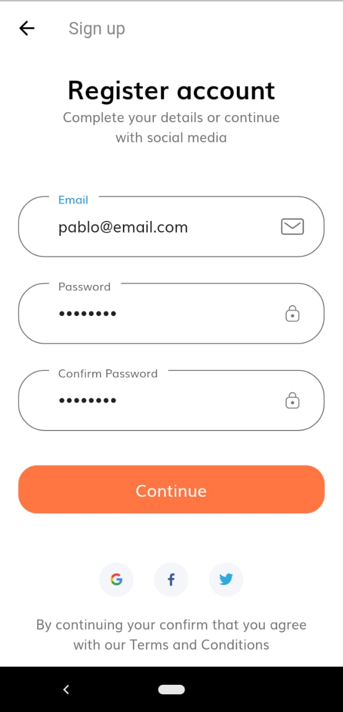
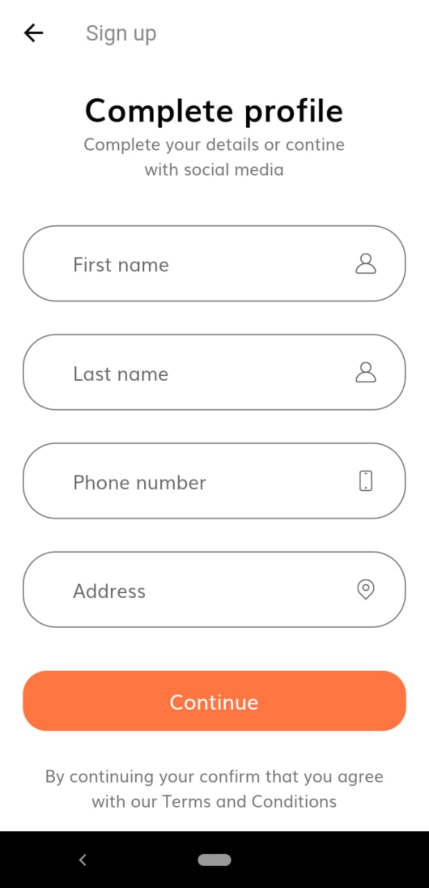
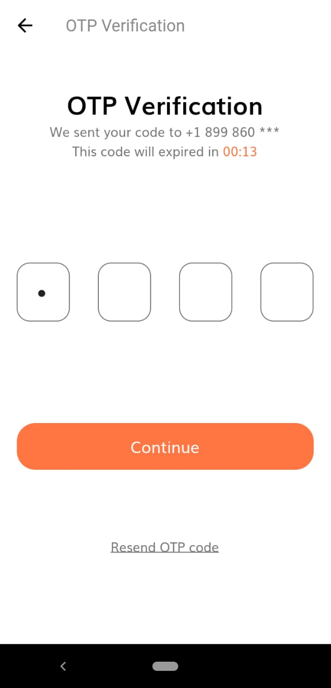
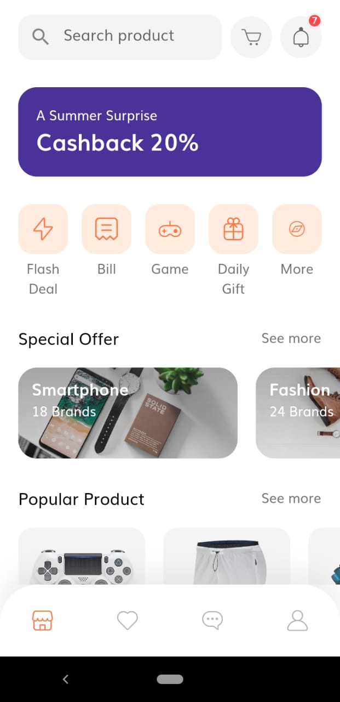
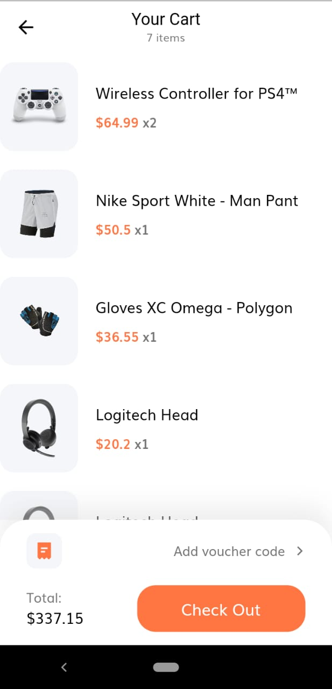
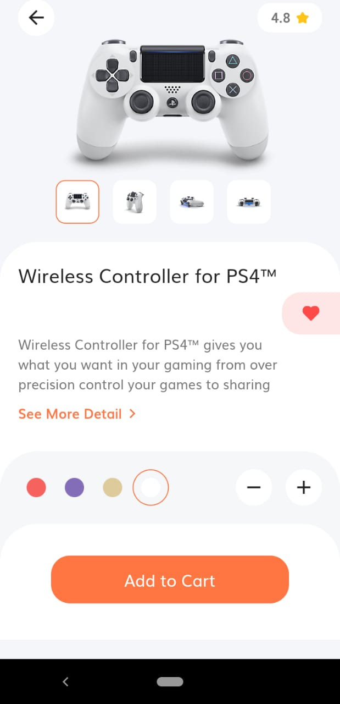
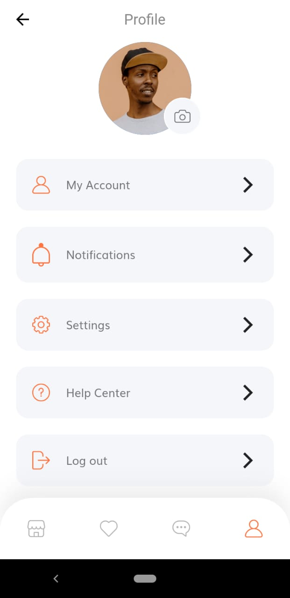

  

  

  

  

  

  

# Shopping app

App UI based on [Tokoto design](https://dribbble.com/shots/13681540-Tokoto-E-Commerce-Continue) 

## Some screens

- Onboarding / Sign In

    
    

- Sign Up / Complete profile / Otp

    
    
    

- Home / Cart / Details

    
    
    

- Profile

    

